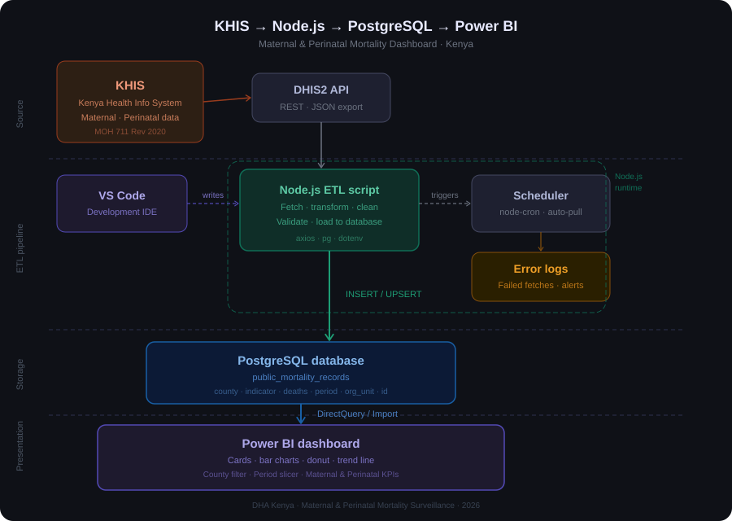

https://app.powerbi.com/groups/me/reports/bdf056d7-b689-4c48-8370-07ff0f511b0b/0838f19c357e2405feb9?experience=power-bi


# KHIS Maternal & Perinatal Death Surveillance Pipeline

A data pipeline that extracts maternal and perinatal mortality data from the Kenya Health Information System (KHIS/DHIS2), loads it into PostgreSQL, and visualises it through a Power BI dashboard.

## Built for
Lwala Community Alliance · Research & Learning ·

---

## Tech stack
- **Source** — KHIS / DHIS2 REST API
- **Pipeline** — Node.js (axios, pg, dotenv, node-cron)
- **Database** — PostgreSQL
- **Dashboard** — Power BI Desktop

## Architecture


---

## How it works
1. Node.js fetches aggregate mortality data from the KHIS DHIS2 API
2. Data is validated, transformed, and loaded into PostgreSQL (`mortality_records` table)
3. Power BI connects to PostgreSQL via DirectQuery to power the dashboard
4. A node-cron job automates the pipeline to run monthly

---

## Project structure
```
├── etl.js                  # Main extract-transform-load script
├── db.js                   # PostgreSQL connection pool
├── setup.js                # Creates database tables
├── transformed_data.csv    # Exported mortality records
├── .env.example            # Environment variable template
├── .gitignore
└── README.md
```

---

## Setup

1. Clone the repo
   ```bash
   git clone https://github.com/marymany68/KHIS.API_repo.git
   cd KHIS.API_repo
   ```

2. Install dependencies
   ```bash
   npm install
   ```

3. Create a `.env` file based on `.env.example`
   ```env
   DHIS2_BASE_URL=https://play.dhis2.org/demo
   DHIS2_USER=your_username
   DHIS2_PASS=your_password
   DB_HOST=localhost
   DB_PORT=5432
   DB_NAME=LWALADB
   DB_USER=postgres
   DB_PASSWORD=your_db_password
   ```

4. Create the database table
   ```bash
   node setup.js
   ```

5. Run the pipeline
   ```bash
   node etl.js
   ```

---

## Data
The `mortality_records` table contains:
- `period` — reporting month (YYYYMM)
- `org_unit` — facility name
- `county` — Kenya county
- `indicator` — death type (maternal / perinatal)
- `deaths` — count
- `data_quality_flag` — TRUE if denominator is zero

---

## Dashboard
Power BI dashboard shows:
- Maternal deaths card
- Perinatal deaths card
- Total deaths card
- Deaths by indicator (donut chart)
- Top counties by deaths (bar chart)
- Monthly trend line

---

end
